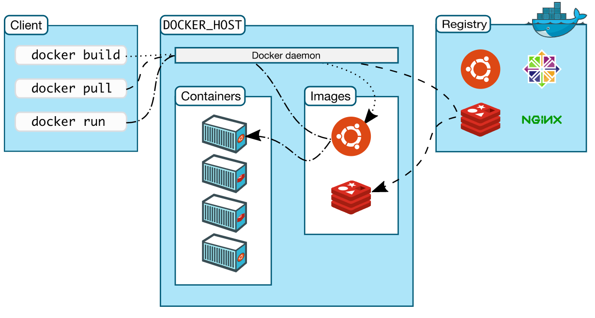
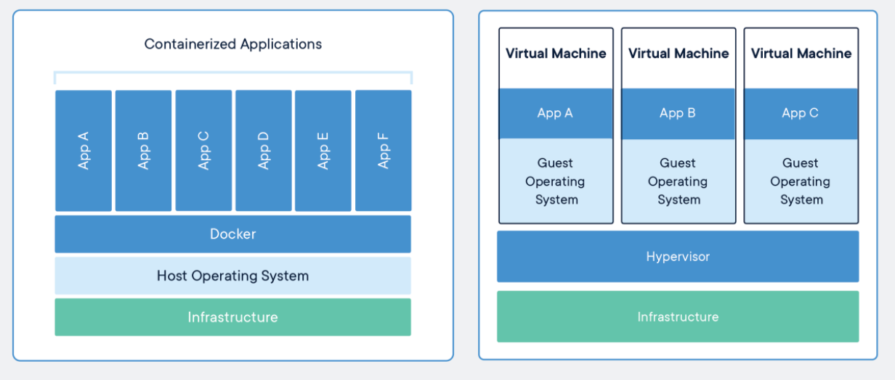

# Docker

Docker 是一个用于基于容器构建应用程序的软件平台，旨在使使用容器更轻松地创建，部署和运行应用程序。

容器使开发人员可以将应用程序与所需的所有部分（如库和其他依赖项）打包在一起，并将其作为一个包进行部署。这样，借助容器，开发人员可以放心，该应用程序可以在任何其他Linux机器上运行，而不管该机器可能具有的用于与编写和测试代码的机器不同的任何自定义设置。

Docker 提供了在松散隔离的环境（称为容器）中打包和运行应用程序的功能。Docker 使用 Docker Engine 将 `物理硬件` 与 `应用程序` 进行隔离。

## Docker Engine （Docker 引擎）

Docker Engine 包括以下主要组件：

- Docker 守护进程（dockerd \<docker daemon\>）。
- REST API 指定程序与守护进程进行通信的操作接口。
- CLI 命令行 （一系列 docker 命令）。

> Docker CLI 使用 REST API 通过 CLI 命令来去控制 Docker 守护进程进行交互。许多其他的 Docker 应用程序都是用基础的 API 和 CLI。守护进程创建和管理 Docker 对象。例如：images (镜像)，containers (容器)，network（网络），data valumes (数据卷)。

## Docker Architecture （Docker 架构）

Docker 是 Client-Server (客户端-服务端 \< CS \>) 服务架构。客户端与 Docker 守护进程（服务端）进行对话，守护进程完成构建，运行和分发 Docker 容器的繁重工作。Docker 客户端和守护进程在 UINX 套接字或者网络接口上使用 REST API 进行通信。

## Docker 的架构和底层技术

Docker 使用 GO 语言编写的，并利用 Linux 内核的多个功能来进行交付。

### namespace (命名空间)

使用 namespace 的技术，为工作区的容器进行隔离。运行容器时，Docker 会为该容器创建一组 namespace。 且该命名空间提供了一层隔离。容器的每个方面都在单独的命名空间中运行。并且访问仅限于该命名空间。

- pid：进程隔离。（进程 ID）
- net：网络接口。
- ipc：访问 ipc（Inter-Process Communication） 资源 （进程间通信）
- mnt：文件系统挂载点
- uts：隔离内核和版本标志符 （UTS：UINX 时间共享系统）

### Control Groups （控制组）

cgroups 将应用程序限制为一组特定的资源。Control Groups 允许 Docker 引擎将可用的硬件资源共享给容器，并有选择的进行实施限制和约束。例如：限定特定容器的可用内存。

### Union file systems （联合文件系统）

使用 UnionFS 可以快速轻便的进行创建 images，对 containers 和 images 进行分层。

## What is a images? (什么是镜像？)

镜像是一个只读的 (read-only) 的模板，是一个文件和 meta data 的集合 (root filesystem)，并且镜像的构建是采用分层存储的架构，每一层都可以添加改变删除文件成为一个新的镜像。前一层是后一层的基础。每一层构建完就不会再发生改变，后一层上的任何改变只发生在自己这一层。比如，删除前一层文件的操作，实际不是真的删除前一层的文件，而是仅在当前层标记为该文件已删除。

分层存储的特征还使得镜像的复用、定制变的更为容易。甚至可以用之前构建好的镜像作为基础层，然后进一步添加新的层，以定制自己所需的内容，构建新的镜像。

## What is a container? (什么是容器？)

容器的实质是进程，但与宿主机实际的进程又有不同，就像是运行在机器上的所有其他进程隔离的另一个进程。这种隔离就是利用了内核的 namespace （命名空间） 和 Control Groups (控制组)。

每一个容器运行时，是以镜像为基础层，在其上创建一个当前容器的存储层，我们可以称这个为容器运行时读写而准备的存储层为 容器存储层。
容器存储层的生存周期和容器一样，容器消亡时，容器存储层也随之消亡。因此，任何保存于容器存储层的信息都会随容器删除而丢失。

- 通过 images 创建容器 (copy)
- 类和实例的关系：images 是类，container 是实例
- 运行时会在images layer (read-only) 上创建一个容器layer (read-write)
- images 负责 APP 的存储和分发，container 负责运行 APP

## What is a container image？( 什么是容器镜像)

当运行一个容器时它是的是一个独立的文件系统。而这个独立的文件系统则是由 容器 images （镜像）提供的。由于镜像包含容器的文件系统，因此必须包含运行应用程序所需的所有内容 ——> 依赖项、脚本、配置、二进制文件、环境变量、元数据以及运行的命令等。

## 容器与传统虚拟机相比

### 容器

容器是应用程序层的抽象，将代码和依赖项打包在一起。多个容器可以在同一台计算机上运行，​​并与其他容器共享OS内核，每个容器在用户空间中作为隔离的进程运行。容器占用的空间少于VM（容器映像的大小通常为几十MB），可以处理更多的应用程序，并且需要的VM和操作系统更少。

### 虚拟机

虚拟机（VM）是将一台服务器转变为多台服务器的物理硬件的抽象。系统管理程序允许多个VM在单台计算机上运行。每个VM包含操作系统，应用程序，必要的二进制文件和库的完整副本-占用数十GB。VM也可能启动缓慢。

## 安装 Docker

- 详细见官网 [Install Docker Engine on CentOS](https://docs.docker.com/engine/install/centos/)
- 其余操作系统请参考 [Install Docker Engine](https://docs.docker.com/engine/install/)

## 参考资料

- [Docker 概述](https://docs.docker.com/get-started/overview/)